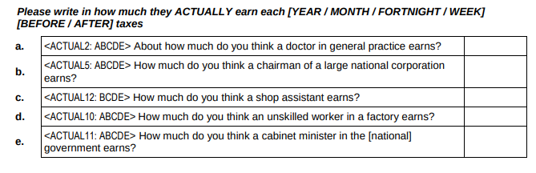
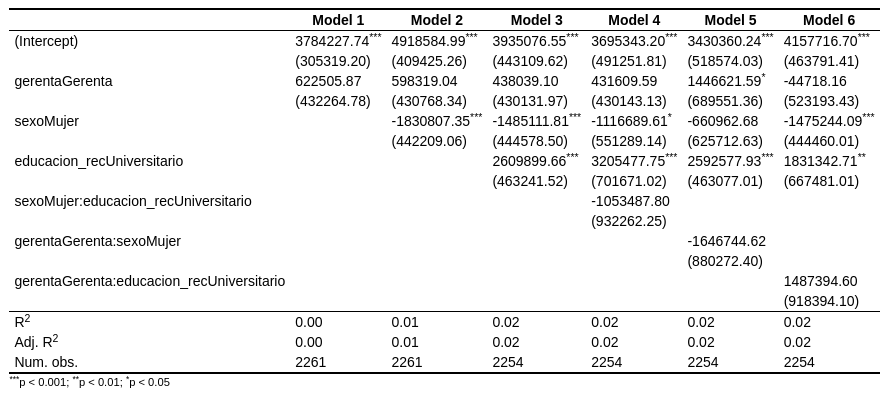

class:  title-slide

```{r xaringanExtra, echo = FALSE}
  xaringanExtra::use_progress_bar(color = "red", location = c("top"))
```


```{r xaringan-tile-view, echo=FALSE}
xaringanExtra::use_tile_view()
```


.pull-left-narrow[
.content-box-red[

<br>
<br>


.small[
Seminario Internacional Desigualdad y Movilidad Social en América Latina

Buenos Aires, agosto 16-18 2023

]
]
]
.pull-right-wide[


.right[

## Brechas de género en la percepción y justificación de desigualdad salarial en Chile
]


----

.right[
.medium[
<div style="line-height:150%;">
Juan Carlos Castillo<sup>1, 2, 3</sup>
<br> & Kevin Carrasco<sup>3</sup> <br>
</div>

]

.small[
<div style="line-height:100%;">
<br>
1 Department of Sociology, Universidad de Chile
<br>
2 NUDOS - Digital Oportunities and Inequalities Milenium Project
<br>
3 COES - Centre for conflict and social cohesion studies

[juancastillov@uchile.cl](juancastillov@uchile.cl) - [jc-castillo.com](https://jc-castillo.com)

]
]
]


---
class: roja bottom

# Contexto & motivaciones


---
class: middle center


???
1- we are all aware of the existence and persistence of gender pay gaps

2- this is a worldwide phenomenon with large variance between countries, but that in OECD average is about 12 percent

3- most of the research in this area is related to sociostructural factors, but we know little about the extent to which this problem is 1) perceived by the population, 2) if this is something considered unjust or not. 

4- awareness of this problem, specially from the side of women is relevant given that if this situation is misperceived it is difficult to expect reduction of the gender pay gap

---
class: middle


## Investigaciones recientes


- Auspurg, Hinz & Sauer (2017), vignette experiment, respaldan la teoría de la expectativa de recompensas: los hombres y las mujeres sol consideran salarios más bajos para las mujeres

- Sauer (2020): sesgo de evaluación de pago de género en población general pero no en estudiantes universitarios

---
class: middle
.pull-left-narrow[
## Este proyecto]

.pull-right-wide[
.content-box-red[
- _¿En qué medida las brechas salariales de género son .red[percibidas] y .red[justificadas]?_

- Hipótesis de expectativa de recompensas: Hombres y mujeres justifican salarios más bajos para las mujeres

- Sesgo de percepción/hipótesis de comparación del mismo grupo: las mujeres perciben y justifican salarios más bajos, en particular para las mujeres
]
]
---
## Enfoques metodológicos


### 1. .gray[Diferencias entre hombres y mujeres en la percepción y justificación de los salarios (en general)]

### 2. .gray[Diferencias entre hombres y mujeres en la percepción y justificación de los salarios .red[para hombres y mujeres]]


---
## Instrumentos de encuestas

.pull-right-wide[
### - .black[Preguntas sobre salarios percibidos y justos para diferentes ocupaciones] (ISSP)

### - Brechas salariales: .black[ratios entre salarios de ocupaciones de alto y bajo estatus] 
]
---
class: roja bottom right

# Estudio 1: 
## .orange[Brechas de género en la percepción y justificación de salarios]
## ISSP Chile 1999,2009 & 2019

---
## Datos & variables

- ISSP Módulo de desigualdad social Chile 1999 (N=1,503); 2009 (N=1,505), & 2019 (N=1,374)

- Variables:
  - salarios percibidos
  - brecha salarial percibida (gerente/asistente de tienda)
  - salarios justos
  - brecha salarial justa (gerente/asistente de tienda)
  
---
class: center 



---
class: middle 

.pull-left-narrow[
## Salarios percibidos
]
.pull-right-wide[
]

---
class: middle

.pull-left-narrow[
## Salarios justos
]

.pull-right-wide[

]

---
class: middle

.pull-left[
### Brecha percibida
]

.pull-right[
### Brecha justa
]
---
class: middle

.pull-left-narrow[
## Brechas

(gerente/trabajador)
]

.pull-right-wide[

]
---
class: middle center


---

class: middle center


---
class: roja bottom right

### ¿Hay alguna diferencia cuando se pregunta específicamente sobre ocupaciones masculinas y femeninas?
----

# Study 2: 
## .orange[Brechas salariales de género percibidas y justificadas - por género]
### .black[Encuesta Desiguales Chile 2017]

---
## Datos 

- Encuesta Desiguales - PNUD Chile 2017 (N=2,613, 18<)
- https://www.estudiospnud.cl/bases-de-datos/desigualdades-economicas-y-sociales-desiguales-2016/

## Variables
- Salarios percibidos y justos para diferentes ocupaciones:

  - Bloque aleatorio 1: Cajera, doctor, Diputada, gerente
  - Bloque aleatorio 2: cajero, doctora, Diputado, gerenta


---
class: middle center


---
class: middle center


---
## Salario percibido: gerente


---
## Salario justo: gerente


---
class: roja

# Discusión

- Brechas percibidas y justas por género: Mujeres perciben y justifican salarios y brechas más bajas (teoría del referente del mismo género?)

- No hay evidencia hasta ahora para el género de la ocupación

- limitación: bloques fijos por género ocupacional en el estudio 2; no es posible estimar brechas salariales

- próximas investigaciones: encuesta longitudinal alternando el género de las ocupaciones
  -  OSF-preregistration [.yellow[osf.io/9aewg]](https://)


---
class: roja middle

# ¡Muchas gracias!

<br>


.right[
###Más información:

Github repo: [.yellow[github.com/justicia-distributiva/brechas-genero]](https://github.com/justicia-distributiva/brechas-genero)

Contact: juancastillov@uchile.cl - [.yellow[jc-castillo.com]](https://jc-castillo.com)
]

